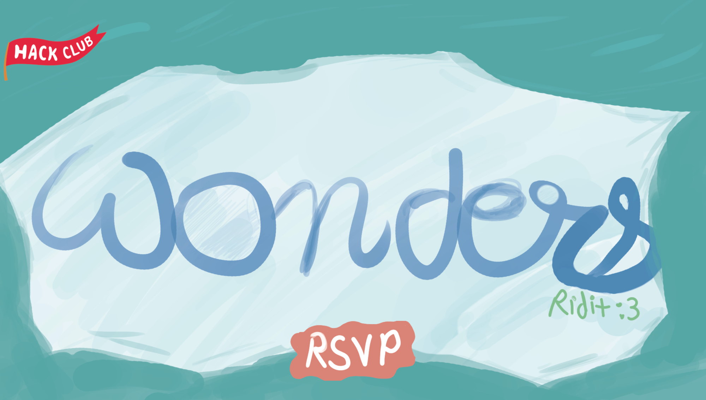
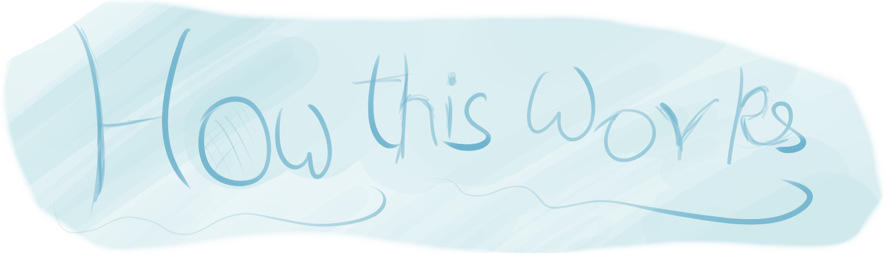
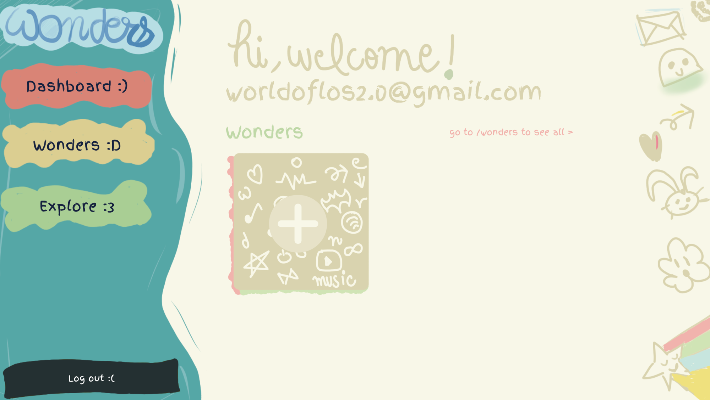
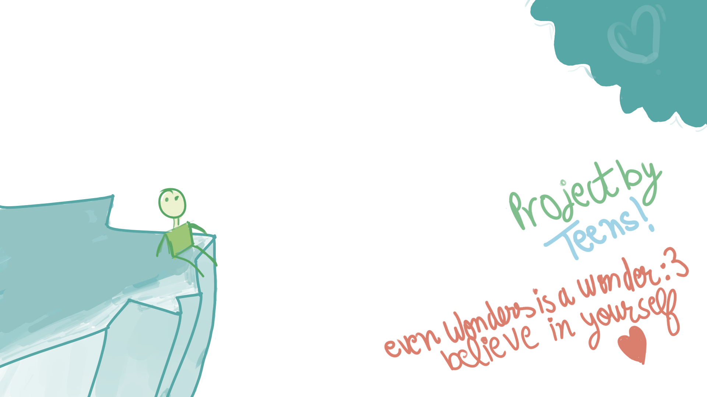

<p align="center">
  
</p>

<h1 align="center">Wonders</h1>

<p align="center">
  <strong>Hours are a terrible way to measure a project.</strong> Some projects take a weekend and change how you think. Some projects take a month and teach you nothing. Wonders is a small web app built for a Hack Club event that throws hackatime out and asks a better question: is this thing a wonder, something that could only have come from you?
</p>

<p align="center">
  <strong>You make something. You ship it.</strong> A real wonderful human reviews it and gives you real opinions and detailled advices.
</p>

---

<h2 align="center">What this is</h2>

<p align="center">Wonders is a Next.js app with two halves:</p>

<p align="center">
  <strong>A landing page</strong> that tells the story. You scroll, the words assemble themselves, and there's crazy illustrations made by me behind everything.
</p>

<p align="center">
  <strong>A dashboard</strong> where you sign in with your Hack Club account, tell us what you're into, and post your projects. Each project gets a status, a spot for your reviewer's note, and room for whatever <em>surprise</em> comes back.
</p>



---

<h2 align="center">The idea behind it</h2>

<p align="center">
  Hack Club runs a lot of events where you log hours and <strong>trade them for prizes</strong>. That works, but it also nudges people toward calculating how much they gonna get instead of caring about the thing they're building. Wonders is a small pushback against that.
</p>

<p align="center">Three lines sum it up, and they're literally the copy that animates in on the homepage:</p>

> Every project tells a story, they shouldn't be judged by hours.
>
> Introducing Wonders!!!
>
> Where every project is a wonder and not a way to farm hours!!

<p align="center"><strong>So there's no hour counter anywhere in this codebase. On purpose.</strong></p>

---



<h2 align="center">How it works for someone using it</h2>

<h3 align="center">1. Find the wonder that could only come from you</h3>

<p align="center">Build the thing. Nobody is counting how long it took. <strong>Hours do not matter here</strong>, and that is not a slogan, it is just how the app is designed.</p>

<h3 align="center">2. Ship it</h3>

<p align="center">Push your repo, put up a demo, and drop both links into the dashboard. Then your project sits in the queue and waits for a cool reviewer.</p>

<h3 align="center">3. Get your reviewer's feedback</h3>

<p align="center">A person reads what you made, plays with the demo, and writes back. Then you wait for a <strong>surprise</strong>.</p>

---

<h2 align="center">The dashboard</h2>

<p align="center">Signing in runs through Hack Club's OAuth, so there is no password for Wonders itself and no account to create. If your Hack Club account is on the allowlist, you are in.</p>


<p align="center">First time through, we ask one question: what interests you the most. Hobbies, obsessions, weird niches, whatever. This is not a random survey to collect your data and sell them. It is so a reviewer can look at your project and your interests side by side and get a feel for whether the project really looks like you.</p>

<p align="center">After that you land on your dashboard. It shows your two most recent wonders and a card to add another. The sidebar gets you to the full list at <code>/wonders</code>, and to explore and log out.</p>

<p align="center">Adding a wonder is four fields: a name, a description of what it is and why it feels like you, a GitHub URL, and a demo URL. All four are required, because a reviewer needs all four to do their job.</p>



<p align="center">Every project carries a status as it moves through the loop:</p>

| Status | What it means |
| --- | --- |
| `building :)` | you're still working on it |
| `shipped :D` | it's live and links are in |
| `in review :3` | a reviewer has it |
| `reviewed :3c` | feedback is back, check the note |

<p align="center">Projects also have a slot for the reviewer's note and one for a reward, both filled in on the reviewer's side.</p>



---

## Running it locally

You need [Bun](https://bun.sh). The repo pins `bun@1.3.13`.

```bash
bun install
bun run dev
```

Then open [http://localhost:3000](http://localhost:3000).

The landing page works with zero configuration, so if you just want to see the scroll story and the art, that is all you need.

### Environment variables

The dashboard, the auth flow, and the database need these. Drop them in `.env.local`:

```bash
# Supabase (server side only, uses the service role key)
SUPABASE_URL=
SUPABASE_SERVICE_ROLE_KEY=

# Hack Club OAuth
HC_AUTH_CLIENT_ID=
HC_AUTH_CLIENT_SECRET=
HC_AUTH_REDIRECT_URI=        # optional, defaults to <your origin>/api/hc-auth/callback

# Session signing
SESSION_SECRET=              # any long random string
```

Anything that touches Supabase is behind `server-only`, so the service role key never ships to the browser. Sessions are a signed cookie: a base64 payload with an HMAC SHA-256 signature and a seven day expiry, checked with a constant time compare.

### Database

Supabase with two tables:

- `profiles`: one row per person, keyed by `slack_id`, holds their name, email, and the interest answer from onboarding.
- `projects`: one row per wonder, linked to a profile, holds the title, description, image, links, status, reviewer note, reward, and timestamps.

---

## How the code is laid out

```
app/
  page.tsx                 landing page, just stacks the four sections
  components/
    Hero.tsx               the painted title screen and RSVP button
    Story.tsx              the 700vh scroll story, framer-motion word by word
    HowThisWorks.tsx       the three steps
    Footer.tsx             the world at the bottom
  login/                   sign in with Hack Club
  onboarding/              the one interest question
  dashboard/               your dashboard, sidebar, project cards
    projects/new/          create a wonder
    projects/edit/[id]/    edit one
  wonders/                 the full list of your projects
  api/
    hc-auth/               login, callback, logout for the OAuth flow
    profile/               read and save your profile

lib/
  hc-auth.ts               session cookie signing and verifying
  profiles.ts              profile reads and writes
  projects.ts              project CRUD
  supabase.ts              the server side client
```

The scroll story in `Story.tsx` is worth a look. It pins a sticky frame for 700vh and maps scroll progress onto per word opacity and position, so the sentences build up, hold, then slide off as you keep scrolling.

---

## A note on the stack

This runs on Next.js 16 with the App Router, React 19, Tailwind v4, and framer-motion. If you are poking at the Next.js internals, read `AGENTS.md` first. This version of Next has breaking changes from what you might remember, and the guides live inside `node_modules/next/dist/docs/`.

---

## Credits

Built for Hack Club. Hero and world art by Ridit. If you make a wonder with it, that is the whole point.
